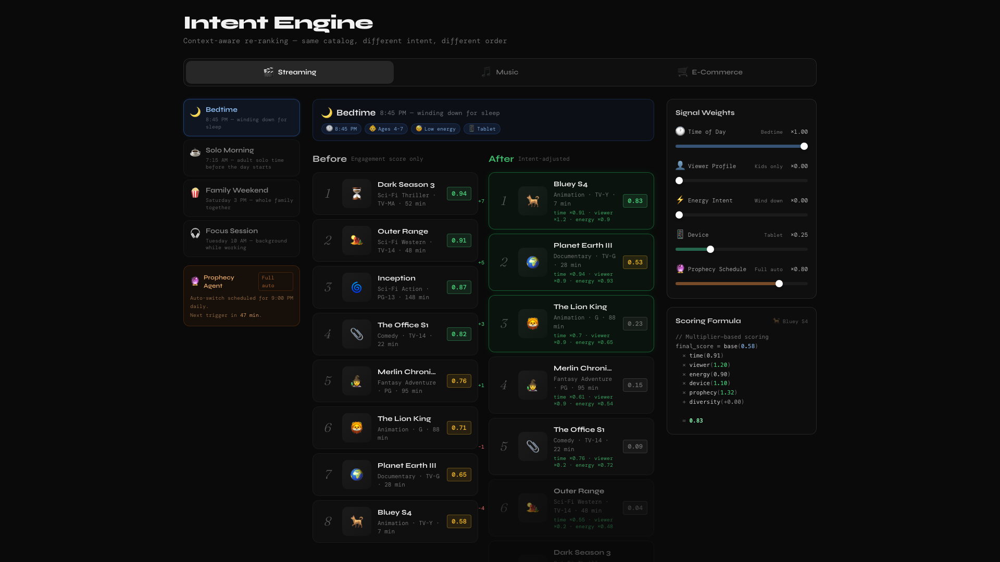
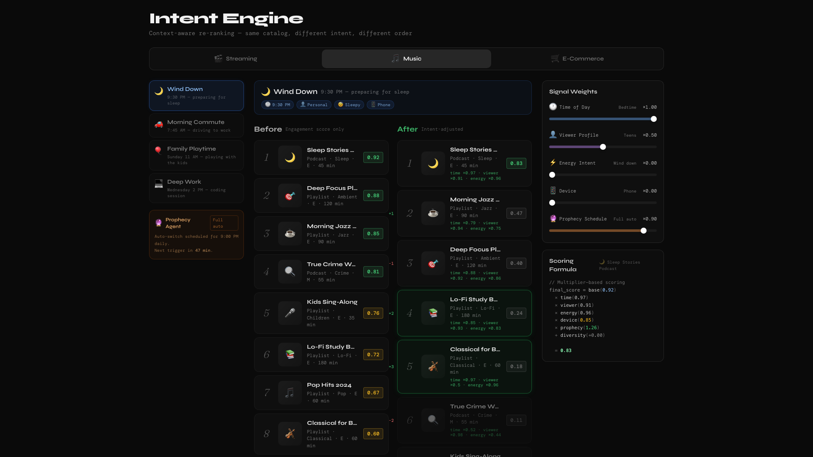
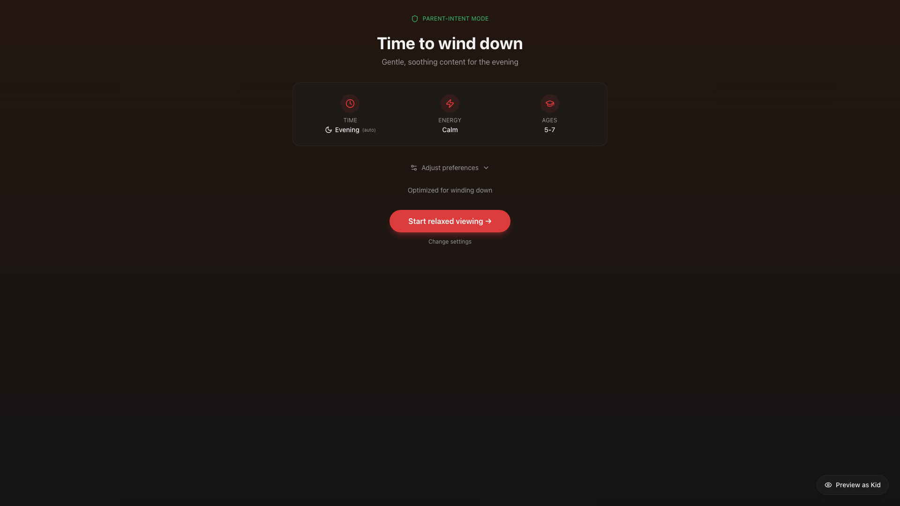
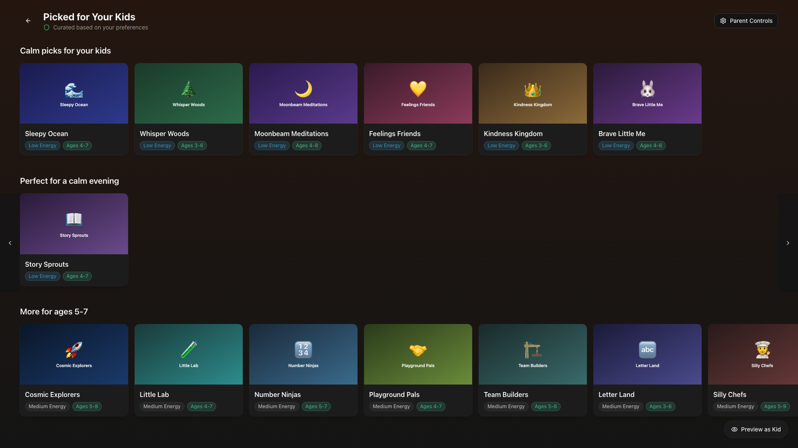
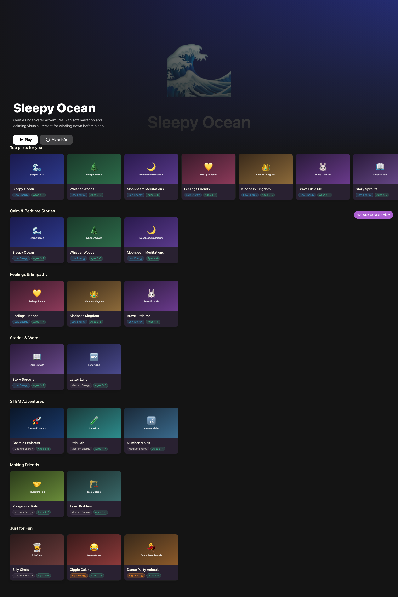
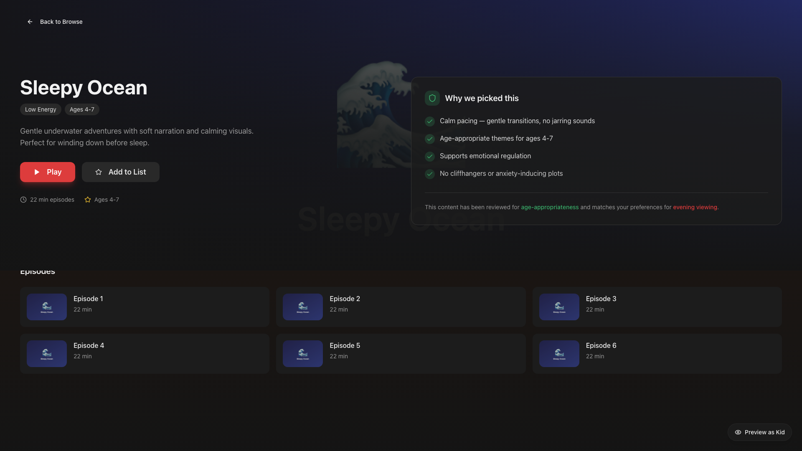
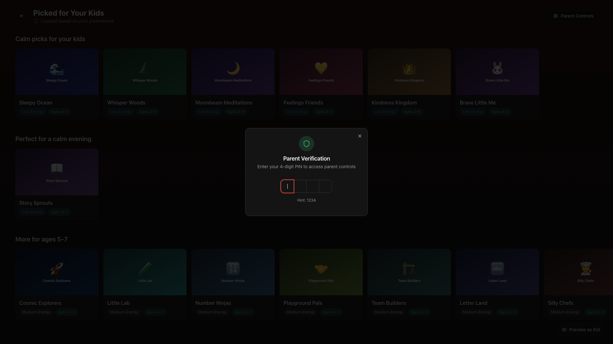
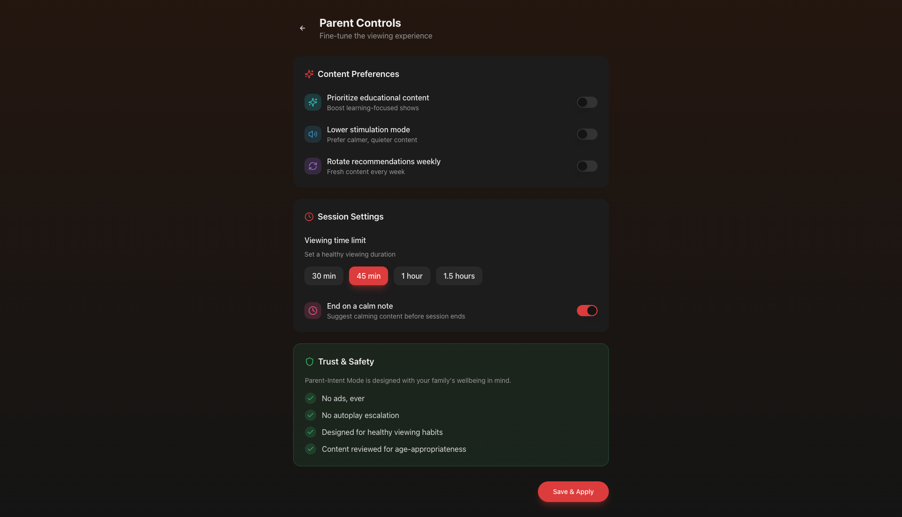
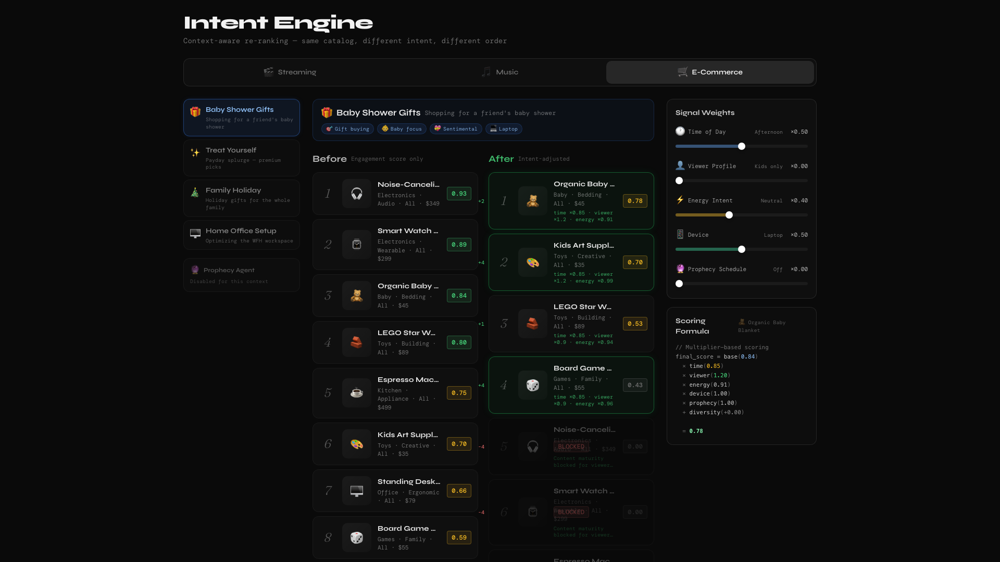

# Intent Engine

A deterministic, intent-aware re-ranking engine with a React prototype UI. It shows how contextual intent signals (time of day, viewer profile, energy level, device) can reshape content recommendations without ML, personalization, or randomness.

> **Prototype.** Built to demonstrate systems thinking and backend architecture, not a production service.

## Why I Built This

As a parent, I spend real time every day filtering kids' content by hand, because streaming recommendations optimize for engagement rather than the intent I have in the moment ("it's bedtime," "keep it calm"). My take as an engineer is that this belongs in a deterministic, explainable re-ranking layer instead of a model you can't inspect: the same context should always produce the same, traceable ordering, and every score should break down into signals a person can read. This repo is where I test that idea across more than one domain.

## Live Demo

**Interactive UI:** [intentengine.vercel.app](https://intentengine.vercel.app)
- **[`/demo`](https://intentengine.vercel.app/demo):** the multi-vertical re-ranking demo (5 verticals, tweakable signals, live scoring formula). This is the main thing to see.
- **[Home](https://intentengine.vercel.app):** parent-intent wizard flow with kid browse, content detail, and PIN gate.

> Also reachable at the original URL, [dist-pied-one-60.vercel.app](https://dist-pied-one-60.vercel.app), which still works.

**Python Backend:** Fully implemented with 274 passing tests

> **Note:** The frontend uses mock data and is not connected to the backend API. Every vertical in the `/demo` UI runs the same deterministic ranking *client-side*; none call the Python backend. The backend runs locally via `uvicorn`.

## What It Does

**Problem:** Parents spend ~10 min/day manually filtering content. Streaming recommendations optimize for engagement, not parental intent.

**Solution:** A re-ranking layer that sits between retrieval and presentation. Parents express context once ("it's bedtime"), and the system adapts deterministically and explainably, with no ML required.

**Key capabilities:**
- Rules-first intent translation (keyword mapping, time-of-day inference)
- Soft-constraint re-ranking (intent boosts items but never filters them)
- Multiplier-based scoring with transparent formula display
- Prophecy Agent for time-aware scheduling (auto-switch to bedtime mode at 8 PM)
- Multi-vertical demo (Streaming, Music, E-Commerce, Ride Matching, Food Delivery)
- Structured explanations for every ranking decision
- Optional LLM fallback (off by default, env-var gated)

## Interactive Demo (`/demo`)

The `/demo` page is an interactive demo showing the engine's re-ranking behavior across platforms.

### Features

| Feature | Description |
|---------|-------------|
| **Platform Tabs** | Switch between 5 verticals (Streaming, Music, E-Commerce, Ride Matching, Food Delivery), 8 items each. Streaming carries a `PILOT` badge in the UI |
| **Context Presets** | 4 presets per platform (e.g., Bedtime, Solo Morning, Family Weekend, Focus Session) |
| **Signal Sliders** | 5 tweakable signals: Time of Day, Viewer Profile, Energy Intent, Device, Prophecy Schedule |
| **Before / After** | Side-by-side view showing engagement-only vs. intent-adjusted ranking |
| **Scoring Formula** | Live code-style display showing the multiplier breakdown for any item |
| **Prophecy Agent** | Mock scheduling indicator with countdown timer |

### Per-Vertical Status

Honest status per vertical. **Functional** means it has a real catalog, 4 context presets, and 5 signal sliders that drive deterministic client-side scoring. All five verticals are functional in the demo; none are UI-only shells or placeholders. None are wired to the Python backend (the demo scores client-side). The backend v3 domain engine now ships an adapter for all five.

| Vertical | Demo UI | Backend adapter |
|----------|---------|-----------------|
| Streaming (`PILOT`) | Functional (client-side) | ✅ `adapters/streaming.py` |
| Music | Functional (client-side) | ✅ `adapters/music.py` |
| E-Commerce | Functional (client-side) | ✅ `adapters/ecommerce.py` |
| Ride Matching | Functional (client-side) | ✅ `adapters/ride_matching.py` |
| Food Delivery | Functional (client-side) | ✅ `adapters/food_delivery.py` |

*No vertical is UI-only or a placeholder. The frontend demo still scores client-side; the backend adapters are exercised by the API and the test suite.*

### Scoring Model

The demo uses a multiplier-based scoring formula:

```
final_score = base_engagement_score
  × time_multiplier        // time-of-day → calm/active preference
  × viewer_multiplier      // kids/family/adult content matching
  × energy_multiplier      // energy intent alignment
  × device_multiplier      // runtime fit for device size
  × prophecy_boost         // scheduled preference amplification
  + diversity_penalty      // penalizes genre repetition

// Hard constraint
if (maturity === "adult" && viewer === "kids") → BLOCKED (score = 0)
```

### Screenshots

| Screen | Description |
|--------|-------------|
|  | Multi-platform demo with signal sliders and before/after ranking |
|  | Live multiplier breakdown for a selected item |
|  | Music platform with wind-down context |

## High-Level Architecture

```
┌──────────────────────────────────────────────────────────────────────────────┐
│                           INTENT ENGINE ARCHITECTURE                        │
└──────────────────────────────────────────────────────────────────────────────┘

                    ┌─────────────────────────────────┐
                    │        USER / PARENT UI          │
                    │  Intent Setup · Kid Browse · Demo │
                    └───────────────┬─────────────────┘
                                    │
                    ┌───────────────▼─────────────────┐
                    │       CONTEXT SIGNALS             │
                    │  Time · Viewer · Energy · Device  │
                    └───────────────┬─────────────────┘
                                    │
              ┌─────────────────────┴──────────────────────┐
              │                                            │
    ┌─────────▼──────────┐                    ┌────────────▼───────────┐
    │   SIMPLE MODE       │                    │    ADVANCED MODE       │
    │                     │                    │                        │
    │ IntentTranslator    │                    │  IntentParser          │
    │ (keyword mapping)   │                    │  (text classification) │
    │       ↓             │                    │        ↓               │
    │ IntentRanker        │                    │  RankingEngine         │
    │ (soft constraints)  │                    │  (multi-factor)        │
    └─────────┬──────────┘                    └────────────┬───────────┘
              │                                            │
              └─────────────────────┬──────────────────────┘
                                    │
                    ┌───────────────▼─────────────────┐
                    │     MULTIPLIER SCORING LAYER      │
                    │                                   │
                    │  base × time × viewer × energy    │
                    │    × device × prophecy + diversity │
                    │                                   │
                    │  Hard constraints: maturity gates  │
                    └───────────────┬─────────────────┘
                                    │
                    ┌───────────────▼─────────────────┐
                    │       PROPHECY AGENT             │
                    │  Time-aware intent scheduling     │
                    │  Auto-switch · Shift prediction   │
                    └───────────────┬─────────────────┘
                                    │
                    ┌───────────────▼─────────────────┐
                    │       RANKED OUTPUT              │
                    │  Items + scores + explanations    │
                    │  + latency breakdown              │
                    └─────────────────────────────────┘
```

### Frontend Demo Architecture

```
┌─────────────────────────────────────────────────────────────────┐
│                        Demo.tsx (page)                          │
│  State: activePlatform · activeContext · signalOverrides        │
│  useMemo: rankWithSignals(catalog, signals) → rankedItems       │
├──────────┬──────────────────────────────┬───────────────────────┤
│  LEFT    │         CENTER               │        RIGHT          │
│          │                              │                       │
│ Context  │  ┌─────────┐ ┌────────────┐  │  Signal Sliders      │
│ Switcher │  │ Before  │ │   After    │  │  (5 signals, 0-1)    │
│ (vertical│  │ column  │ │   column   │  │                       │
│  4 cards)│  │(engage- │ │ (intent-   │  │  Scoring Formula     │
│          │  │ ment)   │ │  adjusted) │  │  (live multiplier    │
│ Prophecy │  └─────────┘ └────────────┘  │   breakdown)         │
│ Agent    │                              │                       │
└──────────┴──────────────────────────────┴───────────────────────┘
                    ▲ PlatformTabs (Streaming · Music · E-Commerce · Ride Matching · Food Delivery)
```

## Project Structure

```
intent-engine/
├── backend/                     # Python backend (FastAPI + ranking engine)
│   ├── intent_engine/
│   │   ├── schemas.py           # Pydantic models (Intent, Item, RankedItem, etc.)
│   │   ├── rules_translator.py  # Rules-first intent translator
│   │   ├── simple_ranker.py     # Soft-constraint re-ranker
│   │   ├── intent_parser.py     # Free-text intent classifier
│   │   ├── ranking_engine.py    # Multi-factor ranker with diversity
│   │   ├── prophecy_agent.py    # Time-aware intent scheduling
│   │   ├── llm_adapter.py       # Optional LLM adapter (OFF by default)
│   │   ├── api.py               # FastAPI REST API
│   │   ├── core/                # v3 domain engine (adapter_protocol, domain_engine)
│   │   └── adapters/            # Domain adapters: streaming, ride_matching, food_delivery, music, ecommerce
│   ├── tests/                   # 274 tests, all passing
│   ├── scripts/                 # Demo scripts
│   └── demo_prophecy.py         # Prophecy Agent demo
├── frontend/                    # React UI prototype
│   ├── src/
│   │   ├── pages/
│   │   │   └── Demo.tsx         # Interactive re-ranking demo page
│   │   ├── components/demo/
│   │   │   ├── PlatformTabs.tsx  # 5 vertical tabs (Streaming PILOT / Music / E-Commerce / Ride / Food)
│   │   │   ├── ContextSwitcher.tsx # Vertical context preset selector
│   │   │   ├── SignalSliders.tsx  # 5 tweakable signal weight sliders
│   │   │   ├── ScoringFormula.tsx # Live multiplier formula display
│   │   │   ├── ProphecyAgent.tsx  # Scheduling indicator with countdown
│   │   │   └── ContentCard.tsx    # Item card with score badge + hover
│   │   └── data/
│   │       ├── demoPlatforms.ts   # 5 catalogs + signal configs + ranking
│   │       └── demoContent.ts     # Legacy streaming-only data
│   └── package.json
├── docs/
│   └── screenshots/             # UI screenshots for documentation
└── README.md                    # This file
```

## Quick Start

### Backend

```bash
cd backend
pip install -r requirements.txt

# Run tests
pytest tests/ -v

# Start API server
uvicorn intent_engine.api:app --reload

# Run demos
python -m scripts.demo_runner
python demo_prophecy.py
```

### Frontend

```bash
cd frontend
npm install
npm run dev
```

Opens on `http://localhost:5173`. Visit `/demo` for the interactive re-ranking demo.

## Two Ranking Modes

The `/rank` endpoint accepts a `mode` field:

| Mode | Pipeline | Use Case |
|------|----------|----------|
| `simple` | IntentTranslator + IntentRanker | Lightweight keyword/preference matching |
| `advanced` (default) | IntentParser + RankingEngine | Multi-factor scoring with diversity guardrails |

## Prophecy Agent

Time-aware intent scheduling that predicts and automates intent shifts:

```python
from intent_engine.prophecy_agent import ProphecyAgent, IntentSchedule, TimeContext
from datetime import datetime, time

agent = ProphecyAgent()
agent.add_schedule(IntentSchedule(
    time_context=TimeContext.BEDTIME,
    start_time=time(20, 0),
    end_time=time(22, 0),
    intent_template={"energyLevel": 15, "tone": "soothing"},
))

# 15 minutes before bedtime, get a proactive suggestion
suggestion = agent.should_suggest_intent_shift(datetime(2026, 2, 20, 19, 50))
```

## Business Case

**Problem:** Parents spend 10 min/day manually filtering content for kids.

**Solution:** Set intent once, and it auto-switches on schedule.

**Impact:** Reducing friction on parent profiles by even 2% churn translates to ~$180M annual revenue opportunity for a platform at Netflix scale.

## Design Principles

1. **Determinism:** same input, same output, every time
2. **Soft constraints:** intent re-ranks, never filters
3. **Explainability:** every score has a human-readable reason
4. **Rules first:** no LLM dependency; the LLM is optional and off by default
5. **Safe defaults:** unknown input degrades gracefully to base-score ordering
6. **Safety first:** hard constraints (age ratings) apply before any ranking logic

## UI Screenshots

### Parent-Intent Flow


**Intent Setup.** The parent sets context once: time of day (auto-detected), energy level, and age range. No configuration fatigue; the system infers sensible defaults, and the parent only overrides what matters. This is the entry point for setting context once.


**Curated Home.** Content rows are re-ranked by the intent engine. "Top picks for your kids" reflects the active intent, not pure engagement scores. The parent sees rows that match their stated context, with energy and age badges on every card.


**Kid Browse.** The child's view is a Netflix-style hero and category-row layout. Content is pre-filtered and ranked by the intent layer before the child ever sees it. Categories like "STEM Adventures," "Calm & Bedtime Stories," and "Feelings & Empathy" are weighted by the parent's intent, not hard-coded.


**Content Detail.** Every recommendation is explainable. The "Why we picked this" panel surfaces the ranking rationale: age-appropriate science concepts, encourages curiosity, promotes critical thinking. Parents can see why something was chosen instead of trusting a black box.


**PIN Gate.** Parent controls sit behind a 4-digit PIN, keeping the child's experience uninterrupted. A familiar pattern: no friction for parents, no access for kids.


**Parent Controls.** Fine-grained preferences: prioritize educational content, lower-stimulation mode, weekly rotation. Session settings include viewing time limits and "end on a calm note," where the system suggests calming content as the timer winds down. The Trust & Safety card covers the basics: no ads, no autoplay escalation, content reviewed for age-appropriateness.

---

### Interactive Demo (`/demo`)


**Re-Ranking Demo (Streaming / Bedtime).** Same 8-item catalog, two columns: engagement-only (left) vs. intent-adjusted (right). At bedtime with a kids viewer profile, Bluey S4 jumps from #8 to #1 (+7 positions). Dark Season 3 (TV-MA) drops to the bottom; the viewer multiplier gates adult content without hard-filtering it. The right panel has 5 signal sliders that update rankings live: drag any slider and the items re-sort. The scoring formula box shows the multiplier math for the #1 item.


**Scoring Formula.** Every ranking decision breaks down into its parts. For Bluey S4: `base(0.58) x time(0.91) x viewer(1.20) x energy(0.90) x device(1.10) x prophecy(1.32) = 0.83`. Each multiplier maps to a single signal slider, so an engineer can trace any ranking anomaly back to the signal that caused it. That keeps debugging the ranking tractable.


**Music Platform (Wind Down).** The same engine works across verticals. In Music with a "Wind Down" context, Sleep Stories Podcast stays #1 (high calm score plus prophecy boost), but Morning Jazz moves up past Deep Focus, because the time multiplier favors familiar, relaxed content over pure ambient. The pipeline is platform-agnostic: swap the catalog and signal configs and keep the same scoring.


**E-Commerce (Baby Shower Gifts).** Intent-aware ranking also applies outside media. With viewer set to "kids" for a gift-buying context, Organic Baby Blanket and Kids Art Kit jump to the top. Noise-Canceling Headphones and Smart Watch Pro are BLOCKED as adult-maturity items gated by the viewer signal. Board Game Collection (family-friendly) gets a +4 boost. The same formula drives it: `viewer(1.20)` for kids items vs. `viewer(0.00)` for adult items.

> Screenshots above cover Streaming, Music, and E-Commerce. The Ride Matching and Food Delivery verticals were added later (see Recent Changes) and are best seen live in the demo.

## Recent Changes

- **2026-07-22:** Added backend `DomainAdapter` implementations for **Music** (`adapters/music.py`) and **E-Commerce** (`adapters/ecommerce.py`), so all five demo verticals now have a matching backend adapter registered on the `/rank` domain engine. Test count grew to 274.
- **2026-03-01:** Expanded the `/demo` from 3 verticals to 5. Added **Ride Matching** and **Food Delivery** tabs (8 items, 4 context presets, 5 domain-specific signal sliders each) and tagged **Streaming** with a `PILOT` badge. The backend gained a v3 domain engine (`core/`) with adapters for streaming, ride_matching, and food_delivery; the test count grew to 237.

## Related Work

- **"The Value of Personalized Recommendations: Evidence from Netflix"** ([Zielnicki, Aridor et al., 2025](https://arxiv.org/abs/2511.07280)) separates the *exposure* effect of recommendations (what gets surfaced) from the *targeting* effect (who gets what). Intent Engine's multiplier panel (`base × time × viewer × energy × device × prophecy`) makes that split visible in the UI: exposure lives in the `base` engagement score, and targeting is the set of per-signal multipliers that reorder items on top of it.
- **"GenPage: Towards End-to-End Generative Homepage Construction at Netflix"** ([Netflix Technology Blog, 2026](https://netflixtechblog.com/genpage-towards-end-to-end-generative-homepage-construction-at-netflix-77146fba8a08)) assembles the homepage with a learned generative model. Intent Engine takes the opposite approach: deterministic and explainable rather than generative, where the same context always produces the same, traceable ordering.
- **Honest limitation:** deterministic scoring gives no causal identification of targeting effects. Because every item is always scored and reordered, never randomly held out, the engine can show *what* the multipliers do but cannot measure their *causal lift*. That would require explicit exploration slots (randomized holdouts), which the engine does not currently have.

## About

Built by [Jeremiah Walters](https://www.linkedin.com/in/jeremiahwalters/) ([GitHub](https://github.com/jtwalters25)). Exploring how thoughtful systems design can make streaming better for families.

## License

MIT
